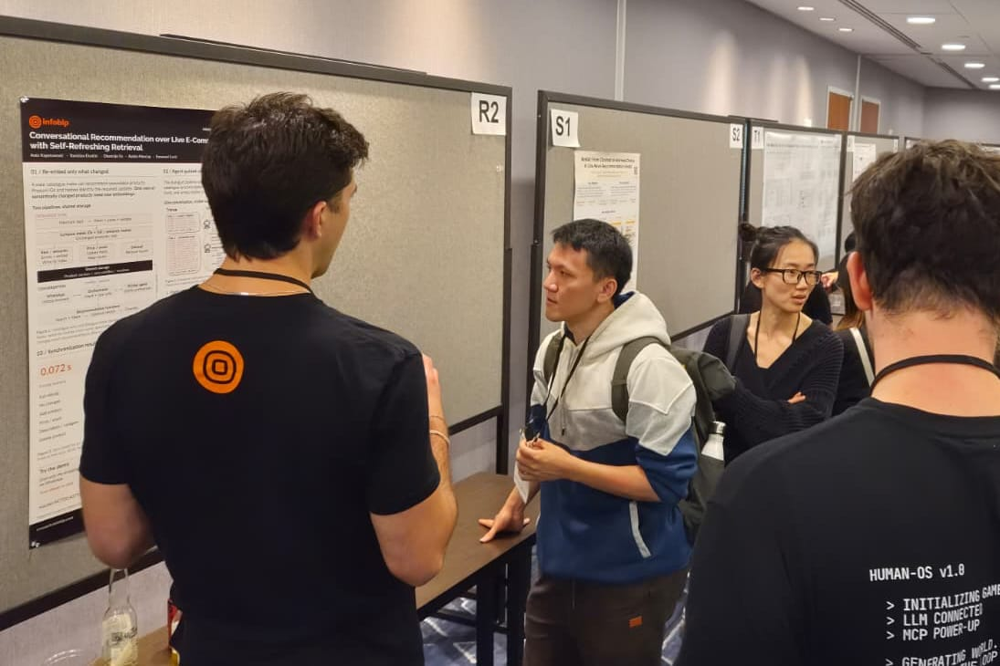
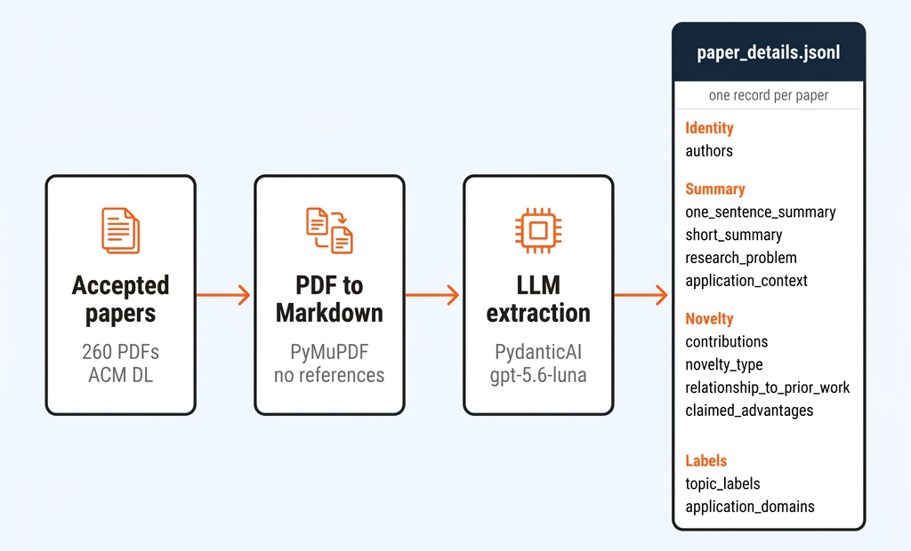
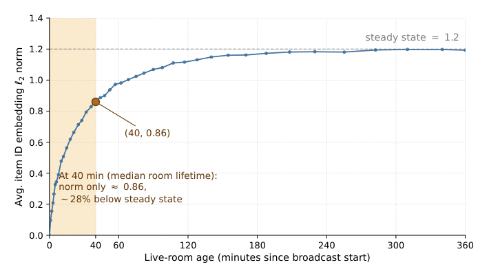
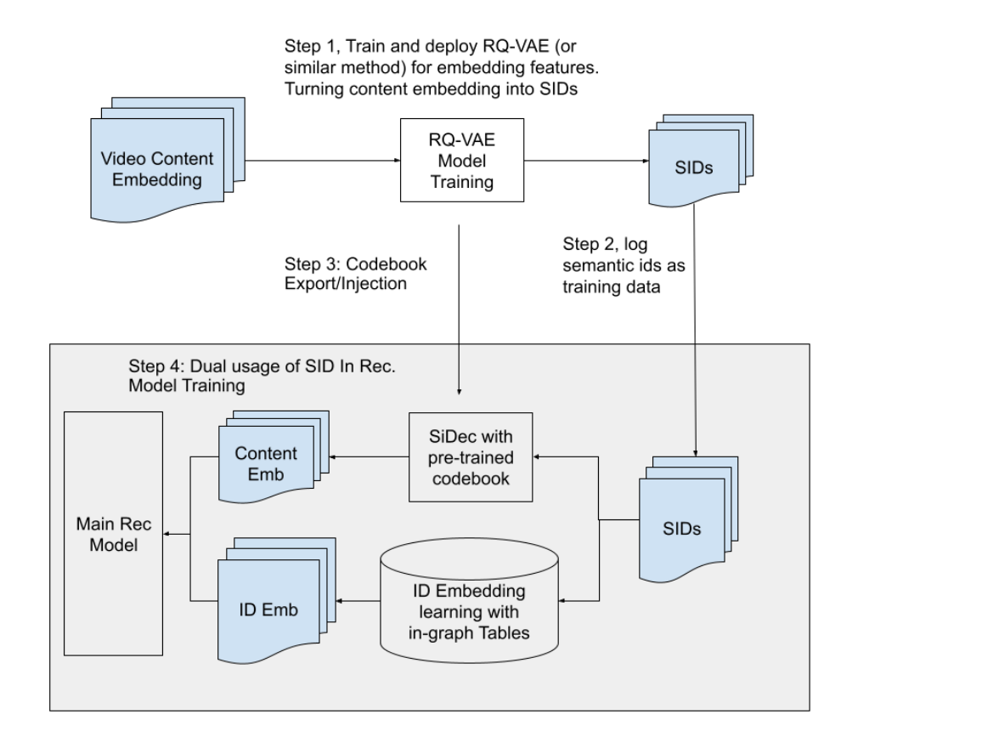
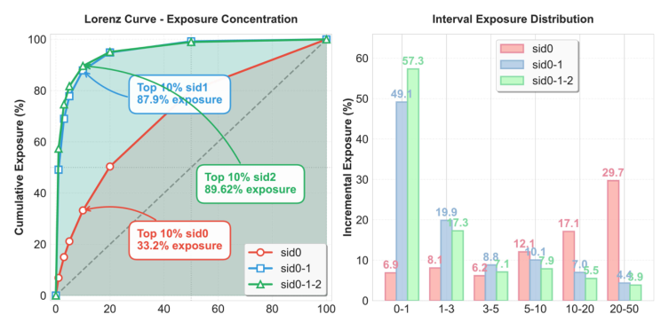
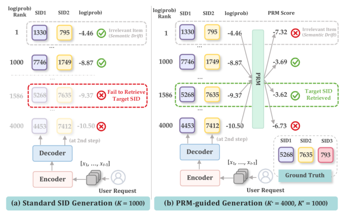

The Infobip research team was in Minneapolis for the [20th RecSys](https://recsys.acm.org/recsys26/) conference. We had a sponsor booth, a lot of good conversations, and our paper [Conversational Recommendation over Live E-Commerce Catalogues with Self-Refreshing Retrieval](https://doi.org/10.1145/3773078.3841297). It describes an agentic WhatsApp shopping assistant that recommends from a merchant catalogue while products are added, repriced, restocked and discontinued. 

*Poster and demo at RecSys 2026.*

When I go to RecSys (or any conference for that matter), I usually attend the sessions I am already interested in. As such, I downloaded all 260 accepted papers to get a view of the whole programme before choosing a session that is related to our work at Infobip.

I converted the PDFs to Markdown and used a PydanticAI agent to extract a json containing each paper's summary, problem, application context, claimed novelty and topic labels. Naturally, as is the trend, I used LLMs (i.e., *gpt-5.6-luna* and some additional logic to save the figures as images correctly) for extraction. 

*The extraction pipeline to get from the programme to a set of paper records.*

The topics which the papers cover fall mostly into representation learning, generative and foundation-model recommendation, conversational systems, offline evaluation, online experimentation, industrial serving and a few other areas. After playing around with different ways to group and generate a knowledge graph, I ended up with 6 broad categories (used Louvain clustering on a co-occurrence graph of the LLM-extracted topic labels). 

*The topic graph for the full RecSys 2026 programme (click for a larger image).*

This map led me to one (for me) interesting topic for which I wanted to know more what the fuss is about. That is, *generative retrieval* and the utilization of **semantic IDs**.

<aside class="explainer" aria-labelledby="explainer-sid">

Background: what is a semantic ID?

Most recommenders give every item an arbitrary ID, like product 4812903. The ID says nothing about the item. The model learns an embedding for each ID from user interactions, so it knows a lot about popular items and next to nothing about a product added this morning. A model that recommends the way an LLM writes text would have to pick one ID out of millions, with no hint of which IDs are related (actually, this reminds me a bit of the problem setting when RNNs were popular).

A semantic ID (SID) replaces the arbitrary number with a few codes derived from the item's content. You pass the item's title, description or image through a pretrained model, and it returns a vector, the content embedding. Similar items get similar vectors and that vector is afterwards quantized (i.e., turned into a few integers).

Quantizing uses a *codebook*, a numbered list of reference vectors which are learned from the catalogue's own embeddings (k-means centroids, for example). A SID chains several codebooks, and each one refines what the previous step missed:

1. Find the closest vector in the first codebook (say 256 entries) and keep its number, e.g. `12`. This is a coarse group.
2. Subtract that vector from the embedding. What's left (the residual) is what step 1 missed. Match it against a second codebook and get, say, `201`.
3. Repeat with the new residual and a third codebook to get `7`.

The item's SID is `<12><201><7>`. This is called residual quantization. To do this we can utilize RQ-VAE to learn the codebooks with a small autoencoder, while RQ-KMeans runs k-means at each step (read more [here](https://arxiv.org/abs/2305.05065) if interested). Either way, the codes go from coarse to fine. In a shop, `<12>` might be footwear, `<12><201>` running shoes and the full SID a handful of near-identical trail runners. By now you get the gist. The idea is that items that share a prefix are close in embedding space.

Three steps of 256 codes give about 16.7 million possible SIDs from only 768 tokens. A huge catalogue can then become a vocabulary that a sequence model can handle, and a new item gets a meaningful SID as soon as its embedding exists. In case when two near-identical items land on the same SID (i.e., a collision can sometimes happen), a common fix is to add one extra code as a counter, so `<12><201><7><0>` and `<12><201><7><1>` are different products.

The early work that introduced this recipe [generative-recommendation design](https://arxiv.org/abs/2305.05065) uses SIDs as the model's output. A user's history becomes the sequence of SIDs of the items they interacted with, and a transformer learns to predict the next item's SID like a LM would predict the next word. At serving time, beam search keeps a few of the best partial sequences, and the finished sequences are mapped back to products through a lookup table. Here, the model decodes freely and simply filters out the small share of IDs that match no real item. But the decoding can also be constrained with a prefix tree of the catalogue's SIDs. In such a scenario, that only codes of real items are produced (as in the Spotify example below). Note that there is no separate kNN search over the catalogue, because decoding does that job.

All of this sounds good, but there are weak spots which you have to tackle. For example, the decisions go from coarse to fine and cannot be undone. If the right item sits under `<12>` and the beam drops `<12>` at the first step, no later step can bring it back.

An SID is also simply a compact, content-aware description of an item, so it is useful without any generation (see [Better Generalization with Semantic IDs](https://arxiv.org/abs/2306.08121)). A ranker can use the codes as categorical features in place of, or alongside, the item ID. Because the model learns one embedding per code value, a new item whose SID starts with `<12><201>` immediately inherits the representations already accumulated by older items sharing that prefix. This means that, for example, your retrieval system can walk the code tree as an index (as seen in the production examples below).

</aside>

Ok, now **back to the analysis of RecSys papers which do talk about semantic IDs**!  Many of them build on the above mentioned generative-recommendation design idea. But some also use semantic IDs as ranking features, compressed representations or serving indexes instead of generating them as the output.

TikTok's [FLUID](https://doi.org/10.1145/3773078.3831918) is an interesting example how to tackle the cold-start problem. It recommends active TikTok Live streams, which the paper calls "rooms". Each room is a new item, so its item embedding has to learn from viewer interactions while the stream is still live. The median duration of a room is about 40 minutes. FLUID replaces the item ID in the ranker with a four-level content code. The reported online gains were +2.05% cold-start room views, +2.87% niche room views and +0.55% quality watch duration.

One emergent behavior here has to be emphasized cause it's easy to miss. FLUID's ranker could identify each live stream in two ways: (1) with the existing item ID or (2) with the new four-level content code. When both were present from the beginning, the model took the easy route and relied on the item ID. It learned nothing useful from the code, and the result was a 0.00% gain. The authors instead introduced the code in stages and removed the item ID later, so the model had to learn from the new representation.

*The item-ID embedding norm is still rising at the median 40-minute lifetime: the room ends before its embedding has finished learning.*

Google's [Tokens are All You Need](https://doi.org/10.1145/3773078.3831900) paper uses the same basic idea for feature storage. For a history of 200 items with 256-dim embeddings, raw features take about 200 KB per example. Logging SIDs and reconstructing the embeddings inside the model raised their training throughput from 12.07 to 15.26 batches per second (compared to feeding raw 64-dim embeddings), with even a slightly better HR@100 of 0.2870 versus 0.2844 for raw embeddings. Meta reports a similar approach for ad creatives in [Text on the Creative](https://doi.org/10.1145/3773078.3831887): three bytes of RQ-VAE codes instead of a dense embedding, roughly 500 times smaller, with a 0.06–0.08% improvement in normalized entropy (their ranking loss) in an online A/B test on video ad surfaces.

*Google uses each SID both as a sparse feature and as a route back to the content embedding.*

Meta reported with [RankGraph-2](https://doi.org/10.1145/3773078.3831843) that they use SIDs in a serving index, where they replaced online KNN with a residual-quantized user index. The paper reports 83% lower serving compute for that retrieval path, a +0.96% CTR and +2.75% CVR in a 14-day A/B test. On the other hand, at [Spotify](https://doi.org/10.1145/3773078.3831914) they use catalogue-constrained SID decoding to turn a natural-language shelf description into items that exist. They used here an offline LLM judge, so I'm eager to hear when they report some  online result.

Another thing to note is that semantic IDs combine identity and meaning, but those properties do *not change at the same rate*.

A codebook is not automatically stable. Google describes codebooks that remain fixed for months or years. Kuaishou's [PLAIN](https://doi.org/10.1145/3773078.3831884) regenerates codes for active streams every two minutes. FLUID moved away from RQ-VAE after codebook entries collapsed during streaming retraining. These systems cover different regimes, but there is still no clear middle ground for refreshing a codebook as a catalogue changes.

Shared prefixes can also blur exact identity. That is useful when the model needs related items, but risky when the user asks for a particular brand, model or product. [Sber](https://doi.org/10.1145/3773078.3841287) reports that the strategy used to resolve the final token changes NDCG@10 by up to 12.7% relative, with no method winning everywhere.

The hierarchy can amplify popularity bias too. In Shopee's [UniRec](https://doi.org/10.1145/3773078.3831776), the top 10% of first-level codes receive 33.2% of exposure. After adding a second code, the top 10% of prefixes receive 87.9%. A capacity-constrained codebook reduced the share going to the top 1% of full SIDs from 57.3% to 26.0%.

*Popularity concentration appears when the SID hierarchy gets deeper.*

Then there is the offline-to-online gap which will vary depending on the application scenario. In [PROMISE](https://doi.org/10.1145/3773078.3831741), the deployed beam configuration improved Recall@100 by 47.92% offline but increased app usage time by 0.131% online. [GLASS](https://doi.org/10.1145/3773078.3831769) reports +21.57% relative H@1 on a public dataset and +0.056% usage time online.

PROMISE also illustrates why decoding is fragile. The authors, for example, showed that standard beam search can prune the target SID before a later reward model has a chance to rescue it.

*PROMISE's reward-guided beam keeps a target that standard beam search would discard.*

## Where semantic IDs might help us

I came away from RecSys curious about semantic IDs, though less for recommendation than for retrieval in general. Turning content into a short, coarse-to-fine code could fit several retrieval problems we work on at Infobip. Over the next months we will look into where it actually helps. For example, I would like to see how much SIDs help an agent pick the right tool or agent from a large registry, and whether they work as a compact index when an agent searches across several knowledge sources. In spam and fraud detection, the shared prefixes might help better group and identify fraudulent messages even when the wording changes. We also want to test whether one codebook can cover text, images and audio together. Some of these ideas will not hold up, but proving our own hunches wrong is more or less in the job description.
